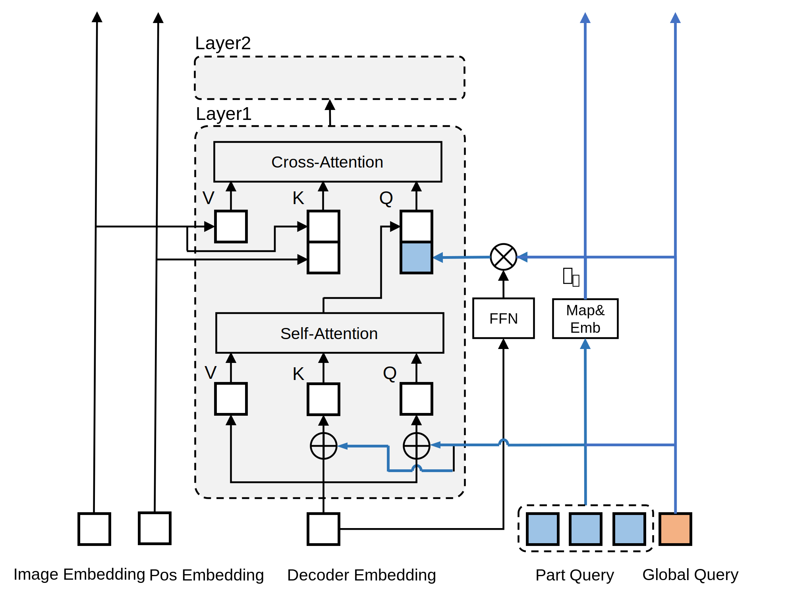
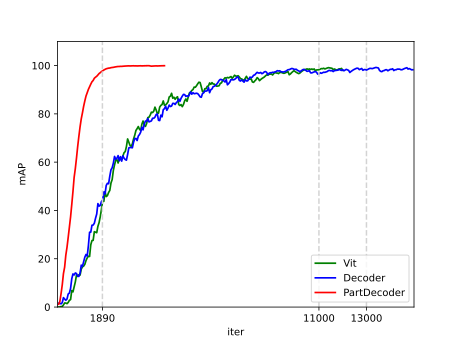

# FARE: A Finer-grained and Fast Converging Appearance Representation Extractor in MOT


This is an **anonymized repository** for ECCV2024, where all personal information is already hidden.

The core code of this project is in `./FARE/`.


# Abstract
The quality of appearance feature extraction plays a decisive role in Multi-Object Tracking(MOT). Recent methods adopt a variety of attention methods to enhance detail representation. But when extreme cases like random occlusions, light variations, and similar appearances occur, relying on an implicit learning style will make it difficult
to maintain feature extraction quality and convergence speed. To this end, we decompose the global feature extraction problem into local fine-grained extraction subproblems which achieves a balance between effectiveness and efficiency. In detail, we design a decoder-only Part Decoder with novel learnable query formulation. It introduces positional priors to achieve part-by-part finer-grained feature pooling and aggregation. To make it sensitive to pixel changes on the initial image, we replace the encoder part with a Pyramid Sampler. It samples primitive information at multi-scale feature layers and projects them into the same embedding space, as the better corpus of Part Decoder. At last, we propose a training data augmentation method Gaussian Erasing Augmentation. It implements an anisotropic Gaussian kernel to make occlusion masks and provide finer-grained training data. Our model achieves +7.94 mAP than SOTA trackers’ ReID network 
and 4.8x faster convergence than comparable architectures.
<center class="half">


</center>
# Models

## Detector

|  Backbone  | size | Mem (GB) | box AP |                  Config                  |                                                                                                                                         Download                                                                                                                                         |
| :--------: | :--: | :------: | :----: | :--------------------------------------: | :--------------------------------------------------------------------------------------------------------------------------------------------------------------------------------------------------------------------------------------------------------------------------------------: |
|  YOLOX-l   | 640  |   19.9   |  49.4  |  [config](./yolox_l_8xb8-300e_coco.py)   |       [model](https://download.openmmlab.com/mmdetection/v2.0/yolox/yolox_l_8x8_300e_coco/yolox_l_8x8_300e_coco_20211126_140236-d3bd2b23.pth)      |
|  YOLOX-x   | 640  |   28.1   |  50.9  |  [config](./yolox_x_8xb8-300e_coco.py)   |       [model](https://download.openmmlab.com/mmdetection/v2.0/yolox/yolox_x_8x8_300e_coco/yolox_x_8x8_300e_coco_20211126_140254-1ef88d67.pth)      |

**Note:**
 In this project we use the [YOLOX](https://arxiv.org/abs/2107.08430) pretrained models from [MMDetection](https://github.com/open-mmlab/mmdetection/tree/main/configs/yolox) without additional traning.

## Re-Identification in MOT
|  Model | Mem(MB) | mAP | Config | Download |
| :-----|:-------:|:---:|:------:|:--------:|
|  Res50 | 99.44   | 50.3|[config](./configs/reid/reid_r50_8xb32-6e_mot17train80_test-mot17val20.py) | [model]() |
| ViT | 138.60 |51.20| [config](./PDTrack/configs/reid_ViT_4xb32-14000iter_mot17train80_test-mot17val20.py)| [model]() |
| Decoder |  142.82 | 51.7 | [config](./PDTrack/configs/reid_Decoder_4xb32-14000iter_mot17train80_test-mot17val20.py)| [model]() |
|Transformer-arch| 136.90|53.40|[config](./PDTrack/configs/reid_Trans_4xb32-14000iter_mot17train80_test-mot17val20.py)| [model]() |
| PartDecoder| 118.70 | **58.24** | [config](./PDTrack/configs/reid_PartDecoder_4xb32-2000iter_mot17train80_test-mot17val20.py)| [model]()            |


# Running 
## Install 

We implement PDTrack based on [MMDectection](https://github.com/open-mmlab/mmdetection) and [MMCV](https://github.com/open-mmlab/mmcv). 

**Step 0.** Install [MMEngie](https://github.com/open-mmlab/mmengine) and [MMCV](https://github.com/open-mmlab/mmcv) using [MIM](https://github.com/open-mmlab/mim):
```
pip install -U openmim
mim install mmengine
mim install "mmcv>=2.0.0"
```

**Step 1.** Install PDTrack.

Install the project to local environment.

```bash
git clone https://anonymous.4open.science/r/FARE-ECCV-5110
cd FARE-ECCV-5110
pip install -v -e . -r requirements/tracking.txt
```
**Step 2.** Install TrackEval.
```
pip install git+https://github.com/JonathonLuiten/TrackEval.git
```

## Data 

Please follow the guide in [MMDectection-tracking](https://github.com/open-mmlab/mmdetection/blob/main/docs/en/user_guides/tracking_dataset_prepare.md) to prepare the datasets as structure as :
```
PDTrack
├── data
│   ├── coco
│   │   ├── train2017
│   │   ├── val2017
│   │   ├── test2017
│   │   ├── annotations
│   │
|   ├── MOT15/MOT16/MOT17/MOT20
|   |   ├── train
|   |   |   ├── MOT17-02-DPM
|   |   |   |   ├── det
|   │   │   │   ├── gt
|   │   │   │   ├── img1
|   │   │   │   ├── seqinfo.ini
│   │   │   ├── ......
|   |   ├── test
|   |   |   ├── MOT17-01-DPM
|   |   |   |   ├── det
|   │   │   │   ├── img1
|   │   │   │   ├── seqinfo.ini
│   │   │   ├── ......
│   │
│   ├── crowdhuman
│   │   ├── annotation_train.odgt
│   │   ├── annotation_val.odgt
│   │   ├── train
│   │   │   ├── Images
│   │   │   ├── CrowdHuman_train01.zip
│   │   │   ├── CrowdHuman_train02.zip
│   │   │   ├── CrowdHuman_train03.zip
│   │   ├── val
│   │   │   ├── Images
│   │   │   ├── CrowdHuman_val.zip
│   │
```

## Training 


Train FARE with 1 GPU on MOT17:
```
python tools/train.py ./FARE/configs/reid_PartDecoder_4xb32-2000iter_mot17train80_test-mot17val20.py --work-dir ./experiments
```


Train FARE with 4 GPUs on MOT17:
```
sh tools/dist_train.sh ./FARE/configs/reid_PartDecoder_4xb32-2000iter_mot17train80_test-mot17val20.py 4 --work-dir ./experiments
```

Train FARE with 4 GPUs on MOT20:
```
sh tools/dist_train.sh ./FARE/configs/reid_PartDecoder_4xb32-2000iter_mot20train80_test-mot20val20.py 4 --work-dir ./experiments
```

Train extral detector with 8 GPUs on crowdhuman:
```
sh tools/dist_train.sh configs/strongsort/yolox_x_8xb4-80e_crowdhuman-mot17halftrain_test-mot17halfval.py 8 --work-dir ./experiments
```

<!-- ## Testing
Test on MOT17-half:
```
sh tools/dist_test.sh  projects/configs/xxxxxx 8 --eval bbox
``` -->

# Cite

# Acknowledgement
This project is inspired by excellent works such as [StrongSORT](https://github.com/dyhBUPT/StrongSORT), [MMDetection](https://github.com/open-mmlab/mmdetection), [YOLOX](https://github.com/Megvii-BaseDetection/YOLOX), [ConditionalDETR](https://github.com/Atten4Vis/ConditionalDETR), [DINO](https://github.com/IDEA-Research/DINO),etc. Many thanks for their wonderful works.